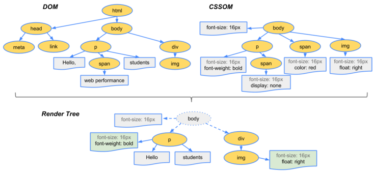

---
group:
  title: article
toc: content
---

# 浏览器的渲染过程

- 解析 HTML，生成 DOM 树，解析 CSS，生成 CSSOM 树
- 将 DOM 树和 CSSOM 树结合，生成渲染树(Render Tree)
- Layout(回流):根据生成的渲染树，进行回流(Layout)，得到节点的几何信息（位置，大小）
- Painting(重绘):根据渲染树以及回流得到的几何信息，得到节点的绝对像素
- Display:将像素发送给 GPU，展示在页面上。

## 生成渲染树

##### 为了构建渲染树，浏览器主要完成了以下工作：

- 从 DOM 树的根节点开始遍历每个可见节点。
- 对于每个可见的节点，找到 CSSOM 树中对应的规则，并应用它们。
- 根据每个可见节点以及其对应的样式，组合生成渲染树。

##### 第一步中，既然说到了要遍历可见的节点，那么我们得先知道，什么节点是不可见的。不可见的节点包括：

- 一些不会渲染输出的节点，比如 script、meta、link 等。
- 一些通过 css 进行隐藏的节点。比如 display:none。注意，利用 visibility 和 opacity 隐藏的节点，还是会显示在渲染树上的。只有 display:none 的节点才不会显示在渲染树上。

## 重绘

我们通过构造渲染树和回流阶段，我们知道了哪些节点是可见的，以及可见节点的样式和具体的几何信息(位置、大小)，那么我们就可以将渲染树的每个节点都转换为屏幕上的实际像素，这个阶段就叫做重绘节点

## 何时发生回流重绘

##### 回流这一阶段主要是计算节点的位置和几何信息，那么当页面布局和几何信息发生变化的时候，就需要回流。比如以下情况：

- 页面一开始渲染的时候（这肯定避免不了）
- 添加或删除可见的 DOM 元素
- 元素的位置发生变化
- 元素的尺寸发生变化（包括外边距、内边框、边框大小、高度和宽度等）
- 内容发生变化，比如文本变化或图片被另一个不同尺寸的图片所替代。
- 浏览器的窗口尺寸变化（因为回流是根据视口的大小来计算元素的位置和大小的）

> #### 回流一定会触发重绘，而重绘不一定会回流
