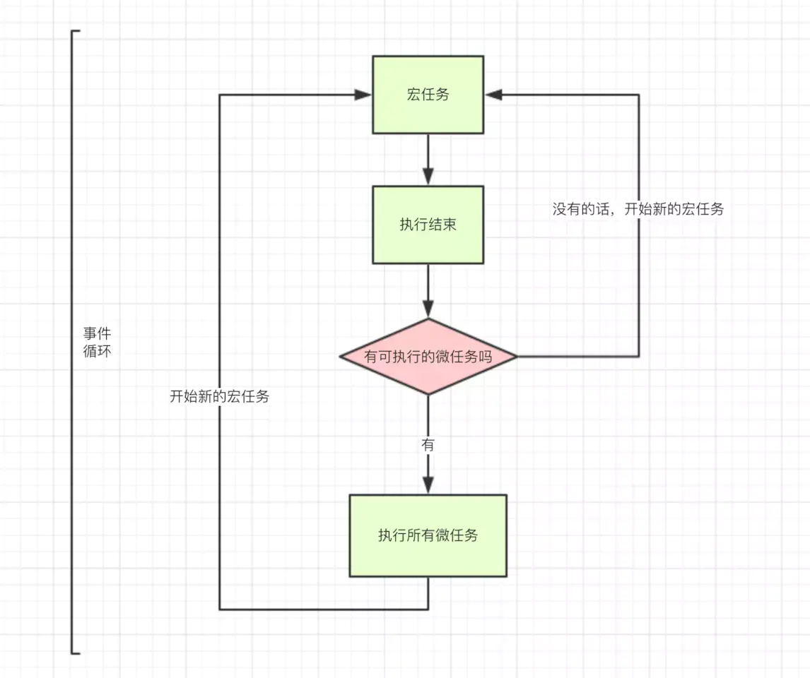

# 事件循环

js是一门单线程语言，同一时间只能处理同一件事情，如果页面发起的网络请求执行时间过长，那么就会造成页面渲染的卡顿，为了解决这一问题，js出现了同步和异步。

- 同步：主线程上的任务，按照顺序由上到下依次执行，当前任务执行完毕后，才能执行下一个任务
- 异步：不进入主线程，而是进入任务队列的任务，执行完毕之后会产生一个回调函数，并通知主线程，当主线程上的任务执行完毕后，就会调取最早通知自己的回调函数，使其进入主线程中执行

## 为什么js是单线程？

js作为主要运行在浏览器中的脚本语言，其主要用途之一是操作dom

如果js可以同时运行两个线程，同时对同一dom进行操作，这时候浏览器应该听哪个线程的，如何判断优先级？

为了避免这种问题，js必须是一门单线程语言，并且在未来这个特点也不会改变。

## js 异步执行的运行机制
1. 所有任务都在主线程上执行，形成一个`执行栈`
2. 主线程之外还有一个`任务队列`，所有异步任务都会放入任务队列之中
3. 一旦`执行栈`的同步任务执行完毕，就会读取`任务队列`中的任务，遵循`先进先出`原则
4. 主线程不断重复上面的步骤3

上面不断重复的过程，我们就称之为`事件循环`

## 微任务(Microtasks)、宏任务(task)？

- 宏任务：事件，网络请求，script整体代码，setTimeout，setInterval、setImmediate((Node.js 环境))。
- 微任务：Promise.then()、process.nextTick、 MutationObserver



- 一个宏任务执行完成过程中，就会去检测微任务队列是否有需要执行的任务，即使是微任务嵌套微任务，也会将微任务执行完成，再去执行下一个宏任务。

## 易错点

- promise 本身是一个同步的代码，只有他后面then方法里的回调才是微任务
- 第一个 await 右边的表达式还是会立即执行，只有表达式之后的代码才是微任务

## 测试

```js
console.log(1);

async function async1() {
  await async2()
  console.log(2)
  await async3()
  console.log(3)
}

async function async2() {
  console.log(4);
}

async function async3() {
  console.log(5);
}

async1()
console.log(6)

// 1 4 6 2 5 3
```

```js
console.log("1");

//setTimeout1
setTimeout(function () {
  console.log("2");
  new Promise(function (resolve) {
    console.log("3");
    resolve();
  }).then(function () {
    console.log("4");
  });
  //setTimeout2
  setTimeout(function () {
    console.log("5");
    new Promise(function (resolve) {
      console.log("6");
      resolve();
    }).then(function () {
      console.log("7");
    });
  });
  console.log("14");
});

new Promise(function (resolve) {
  console.log("8");
  resolve();
}).then(function () {
  console.log("9");
});

//setTimeout3
setTimeout(function () {
  console.log("10");
  new Promise(function (resolve) {
    console.log("11");
    resolve();
  }).then(function () {
    console.log("12");
  });
});

console.log("13");
// 1 8 13 9 2 3 14 4 10 11 12 5 6 7
```

