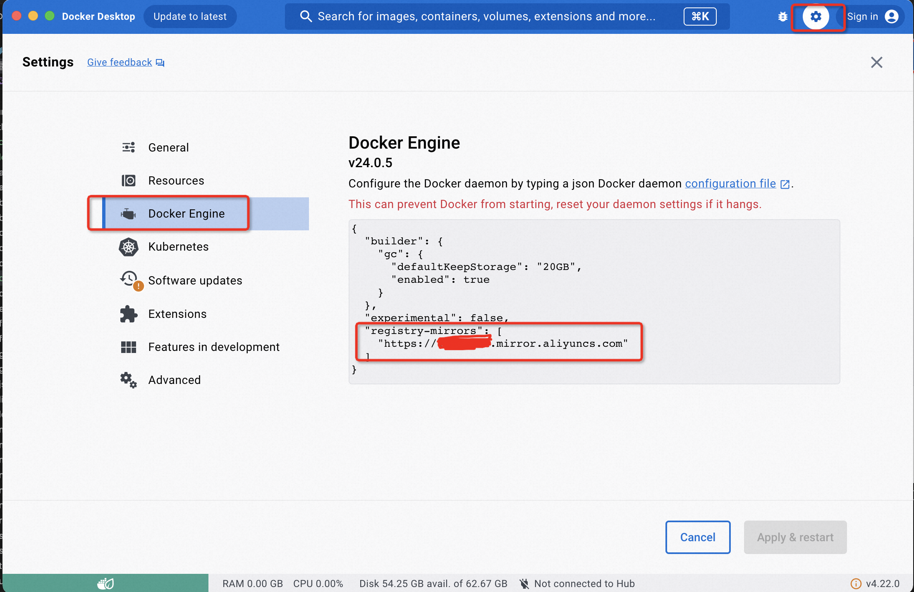
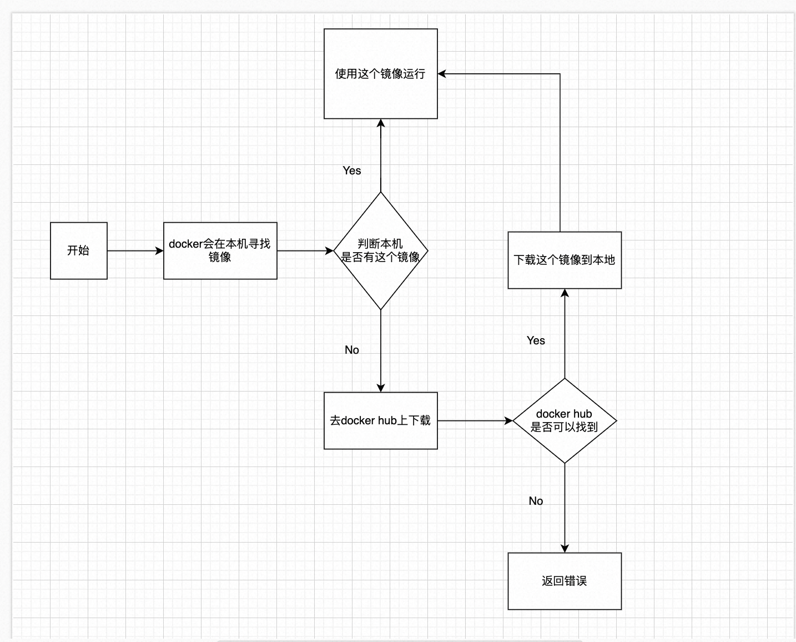
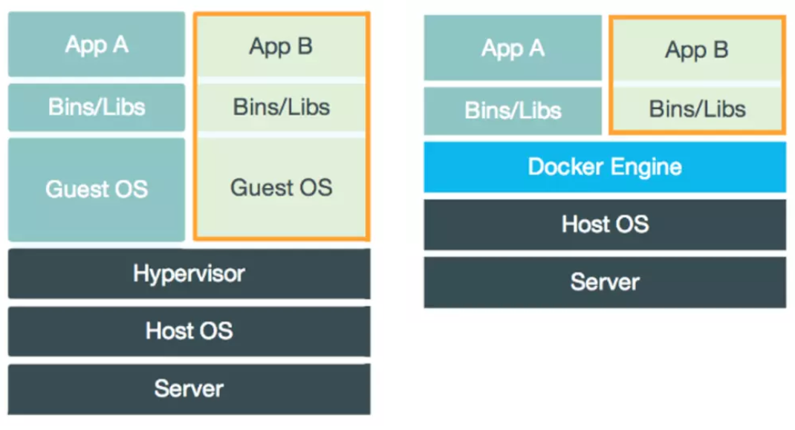
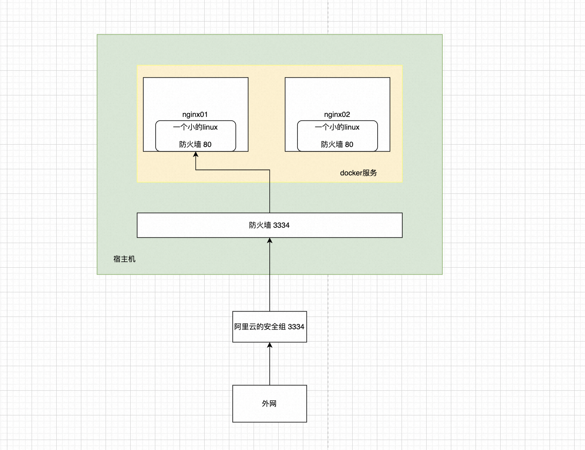

# docker学习

## [docs](https://docs.docker.com/)

<!-- - [docker-machine](https://github.com/docker/machine/releases)
```bash
 curl -L https://github.com/docker/machine/releases/download/v0.16.2/docker-machine-`uname -s`-`uname -m` >/usr/local/bin/docker-machine && \
  chmod +x /usr/local/bin/docker-machine
``` -->

## [install](https://docs.docker.com/engine/install/)

## docker run hello-world

```bash
docker run hello-world
Unable to find image 'hello-world:latest' locally
docker: request returned Bad Gateway for API route and version http://%2FUsers%2Fshihuali%2F.docker%2Frun%2Fdocker.sock/v1.43/images/create?fromImage=hello-world&tag=latest, check if the server supports the requested API version.
See 'docker run --help'.
```

## 配置[阿里云镜像](https://cr.console.aliyun.com/cn-chengdu/instances/mirrors)

- 点击 Docker Desktop 应用图标 > 设置 > Docker Engine, 将 https://xxxx.mirror.aliyuncs.com 加到"registry-mirrors"的数组里，点击 Apply & Restart按钮，等待Docker重启并应用配置的镜像加速器。
  

```json
{
  "builder": {
    "gc": {
      "defaultKeepStorage": "20GB",
      "enabled": true
    }
  },
  "experimental": false,
  "registry-mirrors": ["https://xxx.mirror.aliyuncs.com"]
}
```

```bash
docker run hello-world
Unable to find image 'hello-world:latest' locally
latest: Pulling from library/hello-world
2db29710123e: Pull complete
Digest: sha256:2498fce14358aa50ead0cc6c19990fc6ff866ce72aeb5546e1d59caac3d0d60f
Status: Downloaded newer image for hello-world:latest

Hello from Docker!
This message shows that your installation appears to be working correctly.

To generate this message, Docker took the following steps:
 1. The Docker client contacted the Docker daemon.
 2. The Docker daemon pulled the "hello-world" image from the Docker Hub.
    (amd64)
 3. The Docker daemon created a new container from that image which runs the
    executable that produces the output you are currently reading.
 4. The Docker daemon streamed that output to the Docker client, which sent it
    to your terminal.

To try something more ambitious, you can run an Ubuntu container with:
 $ docker run -it ubuntu bash

Share images, automate workflows, and more with a free Docker ID:
 https://hub.docker.com/

For more examples and ideas, visit:
 https://docs.docker.com/get-started/
```

## docker run 的流程图



## docker 为什么比 vm 快

- docker有着比虚拟机更少的抽象层
- docker利用的宿主机的内核，vm需要Guest OS



所以说，新建一个容器的时候，docker不需要像虚拟机一样重新加载一个操作系统内核，虚拟机加载Guest OS，分钟级别的，而docker是宿主机的操作系统，
省略了这个复杂的过程，秒级。

## [docker常用命令](https://docs.docker.com/engine/reference/run/)

### docker version

### docker info

### docker images

```bash
docker images -a
REPOSITORY                                                          TAG       IMAGE ID       CREATED         SIZE
hello-world                                                         latest    feb5d9fea6a5   24 months ago   13.3kB


# Options
-a, --all             Show all images (default hides intermediate images)
-q, --quiet           Only show image IDs
```

### docker search 搜索镜像

```bash
Options:
  -f, --filter filter   Filter output based on conditions provided

docker search mysql
NAME                            DESCRIPTION                                     STARS     OFFICIAL   AUTOMATED
mysql                           MySQL is a widely used, open-source relation…   14465     [OK]
mariadb                         MariaDB Server is a high performing open sou…   5520      [OK]
percona                         Percona Server is a fork of the MySQL relati…   621       [OK]
phpmyadmin                      phpMyAdmin - A web interface for MySQL and M…   866       [OK]

docker search mysql --filter=stars=3000
NAME      DESCRIPTION                                     STARS     OFFICIAL   AUTOMATED
mysql     MySQL is a widely used, open-source relation…   14465     [OK]
mariadb   MariaDB Server is a high performing open sou…   5520      [OK]

docker search mysql --limit 2 --format "{{.Name}}: {{.Tag}}"

```

### docker pull 下载镜像

```bash
# 下载镜像 docker pull 镜像名[:tag]
docker pull mysql
Using default tag: latest # 如果不写tag，默认就是 latest
latest: Pulling from library/mysql
72a69066d2fe: Pull complete  # 分层下载， docker image的核心
93619dbc5b36: Pull complete
99da31dd6142: Pull complete
626033c43d70: Pull complete
37d5d7efb64e: Pull complete
ac563158d721: Pull complete
d2ba16033dad: Pull complete
688ba7d5c01a: Pull complete
00e060b6d11d: Pull complete
1c04857f594f: Pull complete
4d7cfa90e6ea: Pull complete
e0431212d27d: Pull complete
Digest: sha256:e9027fe4d91c0153429607251656806cc784e914937271037f7738bd5b8e7709
Status: Downloaded newer image for mysql:latest
docker.io/library/mysql:latest # 真实地址

# 等价
docker pull mysql
docker pull docker.io/library/mysql:latest

docker pull mysql:5.7
5.7: Pulling from library/mysql
72a69066d2fe: Already exists # 下载过的镜像，可以共用。
93619dbc5b36: Already exists
99da31dd6142: Already exists
626033c43d70: Already exists
37d5d7efb64e: Already exists
ac563158d721: Already exists
d2ba16033dad: Already exists
0ceb82207cd7: Pull complete
37f2405cae96: Pull complete
e2482e017e53: Pull complete
70deed891d42: Pull complete
Digest: sha256:f2ad209efe9c67104167fc609cca6973c8422939491c9345270175a300419f94
Status: Downloaded newer image for mysql:5.7
docker.io/library/mysql:5.7

docker images
REPOSITORY                                                          TAG       IMAGE ID       CREATED         SIZE
mysql                                                               5.7       c20987f18b13   21 months ago   448MB
mysql                                                               latest    3218b38490ce   21 months ago   516MB
hello-world                                                         latest    feb5d9fea6a5   24 months ago   13.3kB
```

### docker rmi 删除镜像(rmi = reomve image)

```bash
docker rmi c20987f18b13
Untagged: mysql:5.7
Untagged: mysql@sha256:f2ad209efe9c67104167fc609cca6973c8422939491c9345270175a300419f94
Deleted: sha256:c20987f18b130f9d144c9828df630417e2a9523148930dc3963e9d0dab302a76
Deleted: sha256:6567396b065ee734fb2dbb80c8923324a778426dfd01969f091f1ab2d52c7989
Deleted: sha256:0910f12649d514b471f1583a16f672ab67e3d29d9833a15dc2df50dd5536e40f
Deleted: sha256:6682af2fb40555c448b84711c7302d0f86fc716bbe9c7dc7dbd739ef9d757150
Deleted: sha256:5c062c3ac20f576d24454e74781511a5f96739f289edaadf2de934d06e910b92

docker images
REPOSITORY                                                          TAG       IMAGE ID       CREATED         SIZE
mysql                                                               latest    3218b38490ce   21 months ago   516MB
hello-world                                                         latest    feb5d9fea6a5   24 months ago   13.3kB

# 删除所有镜像
docker rmi -f $(docker images -aq)
```

## 容器命令

- 我们有了镜像才可以创建容器，下载一个centos镜像来学习

```bash
docker pull centos
Using default tag: latest
latest: Pulling from library/centos
a1d0c7532777: Pull complete
Digest: sha256:a27fd8080b517143cbbbab9dfb7c8571c40d67d534bbdee55bd6c473f432b177
Status: Downloaded newer image for centos:latest
docker.io/library/centos:latest
```

### 新建容器并启动

```bash
docker run [可选参数] image

# Options
--name string        容器名字，tomcat01, tomcat02， 用来区分容器
-d, --detach         后台方式运行
# -i, --interactive    STDIN open even if not attached
# -t, --tty            Allocate a pseudo-TTY
-it                  使用交互方式运行，进入容器查看内容
-p                   指定容器的端口，-p 8080:8080
  -p ip:主机端口:容器端口
  -p 主机端口:容器端口 (常用)
  -p 主机端口:容器端口
  容器端口
-P                   随机指定端口


# 测试

docker run -it centos /bin/bash
# -it 交互式运行，centos 是镜像，/bin/bash 以什么样的终端进行交互

➜  blog git:(main) ✗ docker images
REPOSITORY   TAG       IMAGE ID       CREATED       SIZE
centos       latest    5d0da3dc9764   2 years ago   231MB
➜  blog git:(main) ✗ docker run -it centos /bin/bash
[root@cecbd4b02db5 /]# ls # 查看容器内的centos, 基础版本，很多命令还是不完善的
bin  dev  etc  home  lib  lib64  lost+found  media  mnt  opt  proc  root  run  sbin  srv  sys  tmp  usr  var
[root@3576810f5231 /]# exit # 退出容器
exit
```

### 列出所有运行的容器

```bash
# docker ps 命令
     # 列出正在运行的容器
-a   # 列出正在运行的容器 + 带出历史运行过的容器
-n=？ # 显示最近创建的容器
-q   # 只显示容器的id
blog git:(main) ✗ docker ps
CONTAINER ID   IMAGE     COMMAND   CREATED   STATUS    PORTS     NAMES

blog git:(main) ✗ docker ps -a
CONTAINER ID   IMAGE          COMMAND       CREATED          STATUS                       PORTS     NAMES
cecbd4b02db5   centos         "/bin/bash"   9 minutes ago    Exited (0) 5 minutes ago               pedantic_wiles

blog git:(main) ✗ docker ps -a -n=1
CONTAINER ID   IMAGE     COMMAND       CREATED          STATUS                      PORTS     NAMES
3576810f5231   centos    "/bin/bash"   12 minutes ago   Exited (0) 10 minutes ago             festive_euclid

blog git:(main) ✗ docker ps -aq
3576810f5231
```

### 退出容器

```bash
exit  # 退出容器，并且停止容器
```

### 删除容器

```bash
docker rm 容器id # 删除指定的容器, 不能删除正在运行的容器，如果要强制删除，加上-f
docker rm -f $(docker ps -aq) # 删除所有的容器
docker ps -aq | xargs docker rm -f # 删除所有的容器
```

### 启动和停止容器的操作

```bash
docker start 容器id # 启动容器
docker stop 容器id # 停止容器
docker restart 容器id # 重启容器
docker kill 容器id # 杀死容器（强制停止）
```

## 常用其他命令

### 后台启动容器

```bash
➜  blog git:(main) ✗ docker run -d centos
774cbf60b4da20bc461874333f29b4dbdc7f50809967754540f15a892ea935f9
➜  blog git:(main) ✗ docker ps
CONTAINER ID   IMAGE     COMMAND   CREATED   STATUS    PORTS     NAMES
➜  blog git:(main) ✗

# docker ps 发现 centos 停止了

# 常见的坑，docker容器使用后台运行，就必须有一个前台进程，docker发现没有应用，就会自动停止
```

### 查看日志

```bash
docker logs -tf --tail 10 容器id， 没有日志

# 自己编写一段shell脚本
➜  blog git:(main) ✗ docker run -d centos /bin/sh -c 'while true;do echo hello-world;sleep 1; done;'
03c7f364f5832e6d3f16dd8cb749ecb7a6ed7e0368c5493d8f63456bd7947d9d
➜  blog git:(main) ✗ docker ps
CONTAINER ID   IMAGE     COMMAND                  CREATED         STATUS         PORTS     NAMES
03c7f364f583   centos    "/bin/sh -c 'while t…"   9 seconds ago   Up 8 seconds             romantic_kilby
abec0474048f   centos    "/bin/bash"              4 minutes ago   Up 4 minutes             naughty_chatterjee
➜  blog git:(main) ✗ docker logs -tf --tail 10 03c7f364f583
2023-09-22T00:42:53.521751442Z hello-world
2023-09-22T00:42:54.526783926Z hello-world

# 参数

-t # 显示时间戳
-f # Follow log output(实时显示)
--tail # 显示多少条日志
```

### 查看容器内部的进程信息

```bash
➜  blog git:(main) ✗ docker top 03c7f364f583
UID                 PID                 PPID                C                   STIME               TTY                 TIME                CMD
root                899                 851                 0                   00:42               ?                   00:00:00            /bin/sh -c while true;do echo hello-world;sleep 1; done;
root                2352                899                 0                   00:49               ?                   00:00:00            /usr/bin/coreutils --coreutils-prog-shebang=sleep /usr/bin/sleep 1

```

### 查看镜像的元数据

```bash
➜  blog git:(main) ✗ docker inspect 03c7f364f583
[
    {
        "Id": "03c7f364f5832e6d3f16dd8cb749ecb7a6ed7e0368c5493d8f63456bd7947d9d",
        "Created": "2023-09-22T00:42:14.087569801Z",
        "Path": "/bin/sh",
        "Args": [
            "-c",
            "while true;do echo hello-world;sleep 1; done;"
        ],
        "State": {
            "Status": "running",
            "Running": true,
            "Paused": false,
            "Restarting": false,
            "OOMKilled": false,
            "Dead": false,
            "Pid": 899,
            "ExitCode": 0,
            "Error": "",
            "StartedAt": "2023-09-22T00:42:14.310069225Z",
            "FinishedAt": "0001-01-01T00:00:00Z"
        },
        "Image": "sha256:5d0da3dc976460b72c77d94c8a1ad043720b0416bfc16c52c45d4847e53fadb6",
        "ResolvConfPath": "/var/lib/docker/containers/03c7f364f5832e6d3f16dd8cb749ecb7a6ed7e0368c5493d8f63456bd7947d9d/resolv.conf",
        "HostnamePath": "/var/lib/docker/containers/03c7f364f5832e6d3f16dd8cb749ecb7a6ed7e0368c5493d8f63456bd7947d9d/hostname",
        "HostsPath": "/var/lib/docker/containers/03c7f364f5832e6d3f16dd8cb749ecb7a6ed7e0368c5493d8f63456bd7947d9d/hosts",
        "LogPath": "/var/lib/docker/containers/03c7f364f5832e6d3f16dd8cb749ecb7a6ed7e0368c5493d8f63456bd7947d9d/03c7f364f5832e6d3f16dd8cb749ecb7a6ed7e0368c5493d8f63456bd7947d9d-json.log",
        "Name": "/romantic_kilby",
        "RestartCount": 0,
        "Driver": "overlay2",
        "Platform": "linux",
        "MountLabel": "",
        "ProcessLabel": "",
        "AppArmorProfile": "",
        "ExecIDs": null,
        "HostConfig": {
            "Binds": null,
            "ContainerIDFile": "",
            "LogConfig": {
                "Type": "json-file",
                "Config": {}
            },
            "NetworkMode": "default",
            "PortBindings": {},
            "RestartPolicy": {
                "Name": "no",
                "MaximumRetryCount": 0
            },
            "AutoRemove": false,
            "VolumeDriver": "",
            "VolumesFrom": null,
            "ConsoleSize": [
                23,
                140
            ],
            "CapAdd": null,
            "CapDrop": null,
            "CgroupnsMode": "private",
            "Dns": [],
            "DnsOptions": [],
            "DnsSearch": [],
            "ExtraHosts": null,
            "GroupAdd": null,
            "IpcMode": "private",
            "Cgroup": "",
            "Links": null,
            "OomScoreAdj": 0,
            "PidMode": "",
            "Privileged": false,
            "PublishAllPorts": false,
            "ReadonlyRootfs": false,
            "SecurityOpt": null,
            "UTSMode": "",
            "UsernsMode": "",
            "ShmSize": 67108864,
            "Runtime": "runc",
            "Isolation": "",
            "CpuShares": 0,
            "Memory": 0,
            "NanoCpus": 0,
            "CgroupParent": "",
            "BlkioWeight": 0,
            "BlkioWeightDevice": [],
            "BlkioDeviceReadBps": [],
            "BlkioDeviceWriteBps": [],
            "BlkioDeviceReadIOps": [],
            "BlkioDeviceWriteIOps": [],
            "CpuPeriod": 0,
            "CpuQuota": 0,
            "CpuRealtimePeriod": 0,
            "CpuRealtimeRuntime": 0,
            "CpusetCpus": "",
            "CpusetMems": "",
            "Devices": [],
            "DeviceCgroupRules": null,
            "DeviceRequests": null,
            "MemoryReservation": 0,
            "MemorySwap": 0,
            "MemorySwappiness": null,
            "OomKillDisable": null,
            "PidsLimit": null,
            "Ulimits": null,
            "CpuCount": 0,
            "CpuPercent": 0,
            "IOMaximumIOps": 0,
            "IOMaximumBandwidth": 0,
            "MaskedPaths": [
                "/proc/asound",
                "/proc/acpi",
                "/proc/kcore",
                "/proc/keys",
                "/proc/latency_stats",
                "/proc/timer_list",
                "/proc/timer_stats",
                "/proc/sched_debug",
                "/proc/scsi",
                "/sys/firmware"
            ],
            "ReadonlyPaths": [
                "/proc/bus",
                "/proc/fs",
                "/proc/irq",
                "/proc/sys",
                "/proc/sysrq-trigger"
            ]
        },
        "GraphDriver": {
            "Data": {
                "LowerDir": "/var/lib/docker/overlay2/7e704f7f73f2733491a1b23616ecaa866b17d332a0ef8943e87173e567d07db3-init/diff:/var/lib/docker/overlay2/f1ff8fdebc10dc71e0fd49285f6ee88729cb6dd34259bf0096566602ba3af544/diff",
                "MergedDir": "/var/lib/docker/overlay2/7e704f7f73f2733491a1b23616ecaa866b17d332a0ef8943e87173e567d07db3/merged",
                "UpperDir": "/var/lib/docker/overlay2/7e704f7f73f2733491a1b23616ecaa866b17d332a0ef8943e87173e567d07db3/diff",
                "WorkDir": "/var/lib/docker/overlay2/7e704f7f73f2733491a1b23616ecaa866b17d332a0ef8943e87173e567d07db3/work"
            },
            "Name": "overlay2"
        },
        "Mounts": [],
        "Config": {
            "Hostname": "03c7f364f583",
            "Domainname": "",
            "User": "",
            "AttachStdin": false,
            "AttachStdout": false,
            "AttachStderr": false,
            "Tty": false,
            "OpenStdin": false,
            "StdinOnce": false,
            "Env": [
                "PATH=/usr/local/sbin:/usr/local/bin:/usr/sbin:/usr/bin:/sbin:/bin"
            ],
            "Cmd": [
                "/bin/sh",
                "-c",
                "while true;do echo hello-world;sleep 1; done;"
            ],
            "Image": "centos",
            "Volumes": null,
            "WorkingDir": "",
            "Entrypoint": null,
            "OnBuild": null,
            "Labels": {
                "org.label-schema.build-date": "20210915",
                "org.label-schema.license": "GPLv2",
                "org.label-schema.name": "CentOS Base Image",
                "org.label-schema.schema-version": "1.0",
                "org.label-schema.vendor": "CentOS"
            }
        },
        "NetworkSettings": {
            "Bridge": "",
            "SandboxID": "fedfaa40f9fd2aff4f40383ee8d1b5d5168116f75c09a9c181b3e5df9bd639d8",
            "HairpinMode": false,
            "LinkLocalIPv6Address": "",
            "LinkLocalIPv6PrefixLen": 0,
            "Ports": {},
            "SandboxKey": "/var/run/docker/netns/fedfaa40f9fd",
            "SecondaryIPAddresses": null,
            "SecondaryIPv6Addresses": null,
            "EndpointID": "ba95ae056013d468da2d438050e6c72bd97cd7b45d650c9ee3fb9d21a797fa64",
            "Gateway": "172.17.0.1",
            "GlobalIPv6Address": "",
            "GlobalIPv6PrefixLen": 0,
            "IPAddress": "172.17.0.3",
            "IPPrefixLen": 16,
            "IPv6Gateway": "",
            "MacAddress": "02:42:ac:11:00:03",
            "Networks": {
                "bridge": {
                    "IPAMConfig": null,
                    "Links": null,
                    "Aliases": null,
                    "NetworkID": "7bbe4a444021818acb5126c25767f4fcab697961011d148e8e4272d4fd470f97",
                    "EndpointID": "ba95ae056013d468da2d438050e6c72bd97cd7b45d650c9ee3fb9d21a797fa64",
                    "Gateway": "172.17.0.1",
                    "IPAddress": "172.17.0.3",
                    "IPPrefixLen": 16,
                    "IPv6Gateway": "",
                    "GlobalIPv6Address": "",
                    "GlobalIPv6PrefixLen": 0,
                    "MacAddress": "02:42:ac:11:00:03",
                    "DriverOpts": null
                }
            }
        }
    }
]
```

### 进入正在执行的容器

```bash
# 通常容器以 后台方式 运行的，需要进入容器，修改一些配置。

docker exec -it 容器id bashShell
➜  blog git:(main) ✗ docker ps
CONTAINER ID   IMAGE     COMMAND                  CREATED          STATUS          PORTS     NAMES
03c7f364f583   centos    "/bin/sh -c 'while t…"   17 minutes ago   Up 17 minutes             romantic_kilby
➜  blog git:(main) ✗ docker exec -it 03c7f364f583 /bin/bash
[root@03c7f364f583 /]# ls
bin  dev  etc  home  lib  lib64  lost+found  media  mnt  opt  proc  root  run  sbin  srv  sys  tmp  usr  var
[root@03c7f364f583 /]# ps -ef
UID        PID  PPID  C STIME TTY          TIME CMD
root         1     0  0 00:42 ?        00:00:00 /bin/sh -c while true;do echo hello-world;sleep 1; done;
root      1055     0  0 00:59 pts/0    00:00:00 /bin/bash
root      1094     1  0 01:00 ?        00:00:00 /usr/bin/coreutils --coreutils-prog-shebang=sleep /usr/bin/sleep 1
root      1095  1055  0 01:00 pts/0    00:00:00 ps -ef
[root@03c7f364f583 /]#


## 方式二
# docker attach 容器id
# 正在执行的代码

➜  blog git:(main) ✗ docker attach 685a6efd43ce
hello-world
hello-world
hello-world
hello-world
hello-world
hello-world

# docker exec # 进入容器后开启一个新的终端，可以在里面操作(常用)
# docker attach # 进入容器正在执行的终端，不在启动新的进程。

```

### 从容器内拷贝文件到主机上

```bash
# docker cp 容器id:容器里的路径 宿主机路径
# 进入容器
# cd /home
# touch test.js

➜  blog git:(main) ✗ docker ps -a
CONTAINER ID   IMAGE     COMMAND       CREATED         STATUS                      PORTS     NAMES
4e76fed49632   centos    "/bin/bash"   2 minutes ago   Exited (0) 12 seconds ago             sharp_bouman
➜  blog git:(main) ✗ docker cp 4e76fed49632:/home/test.js ./
Successfully copied 1.54kB to /Users/shihuali/workspace/my/blog/./
```

## 小练习

### 安装nginx

```bash
➜  blog git:(main) ✗ docker search nginx
NAME                                              DESCRIPTION                                     STARS     OFFICIAL   AUTOMATED
nginx                                             Official build of Nginx.                        19046     [OK]
➜  blog git:(main) ✗ docker pull nginx
Using default tag: latest
latest: Pulling from library/nginx
a2abf6c4d29d: Pull complete
a9edb18cadd1: Pull complete
589b7251471a: Pull complete
186b1aaa4aa6: Pull complete
b4df32aa5a72: Pull complete
a0bcbecc962e: Pull complete
Digest: sha256:0d17b565c37bcbd895e9d92315a05c1c3c9a29f762b011a10c54a66cd53c9b31
Status: Downloaded newer image for nginx:latest
docker.io/library/nginx:latest

What's Next?
  View summary of image vulnerabilities and recommendations → docker scout quickview nginx
➜  blog git:(main) ✗ docker run -d --name nginx01 -p 3334:80 nginx
f58edf30620b1e09dc209d13cbc2fd19b79de6f2e5b3ed2e2a5f2090ebf76d64
➜  blog git:(main) ✗ docker ps
CONTAINER ID   IMAGE     COMMAND                  CREATED         STATUS         PORTS                  NAMES
f58edf30620b   nginx     "/docker-entrypoint.…"   4 seconds ago   Up 4 seconds   0.0.0.0:3334->80/tcp   nginx01
➜  blog git:(main) ✗ curl http://localhost:3334/
<!DOCTYPE html>
<html>
<head>
<title>Welcome to nginx!</title>
<style>
html { color-scheme: light dark; }
body { width: 35em; margin: 0 auto;
font-family: Tahoma, Verdana, Arial, sans-serif; }
</style>
</head>
<body>
<h1>Welcome to nginx!</h1>
<p>If you see this page, the nginx web server is successfully installed and
working. Further configuration is required.</p>

<p>For online documentation and support please refer to
<a href="http://nginx.org/">nginx.org</a>.<br/>
Commercial support is available at
<a href="http://nginx.com/">nginx.com</a>.</p>

<p><em>Thank you for using nginx.</em></p>
</body>
</html>
```

- 端口的暴漏
  

- 思考问题

我们每次改动nginx配置文件，都有进入容器内部，十分的麻烦，我要是在容器外部提供一个映射路径，达到在容器外部修改文件，容器内部就可以自定修改？ -v 数据卷

### 安装tomcat

```bash
# 官方推荐的使用方式
docker run -it --rm tomcat:9.0

# 我们之前的启动都是后台启动，停止了容器后，容器还是可以查询到。docker run -it --rm 一般用来测试，用完就删除。


➜  blog git:(main) ✗ docker pull tomcat
Using default tag: latest
latest: Pulling from library/tomcat
0e29546d541c: Already exists
9b829c73b52b: Already exists
cb5b7ae36172: Already exists
6494e4811622: Already exists
668f6fcc5fa5: Already exists
dc120c3e0290: Already exists
8f7c0eebb7b1: Already exists
77b694f83996: Already exists
0f611256ec3a: Pull complete
4f25def12f23: Pull complete
Digest: sha256:9dee185c3b161cdfede1f5e35e8b56ebc9de88ed3a79526939701f3537a52324
Status: Downloaded newer image for tomcat:latest
docker.io/library/tomcat:latest

What's Next?
  View summary of image vulnerabilities and recommendations → docker scout quickview tomcat
➜  blog git:(main) ✗ docker images
REPOSITORY   TAG       IMAGE ID       CREATED         SIZE
nginx        latest    605c77e624dd   21 months ago   141MB
tomcat       9.0       b8e65a4d736d   21 months ago   680MB
tomcat       latest    fb5657adc892   21 months ago   680MB
centos       latest    5d0da3dc9764   2 years ago     231MB
➜  blog git:(main) ✗ docker run -d -p 3335:8080 --name tomcat01 tomcat
939cfc319fc382a99c3bed75ee74b8f77950aa9fe2d20a9648aefa945320dd31
➜  blog git:(main) ✗ docker exec -it tomcat01 /bin/bash
root@939cfc319fc3:/usr/local/tomcat# ls
BUILDING.txt  CONTRIBUTING.md  LICENSE  NOTICE  README.md  RELEASE-NOTES  RUNNING.txt  bin  conf  lib  logs  native-jni-lib  temp  webapps  webapps.dist  work

root@939cfc319fc3:/usr/local/tomcat# ls -la webapps.dist/
total 32
drwxr-xr-x  7 root root 4096 Dec  2  2021 .
drwxr-xr-x  1 root root 4096 Dec 22  2021 ..
drwxr-xr-x  3 root root 4096 Dec 22  2021 ROOT
drwxr-xr-x 15 root root 4096 Dec 22  2021 docs
drwxr-xr-x  7 root root 4096 Dec 22  2021 examples
drwxr-xr-x  6 root root 4096 Dec 22  2021 host-manager
drwxr-xr-x  6 root root 4096 Dec 22  2021 manager

root@939cfc319fc3:/usr/local/tomcat# cp -r webapps.dist/* webapps
root@939cfc319fc3:/usr/local/tomcat# ls -la webapps
total 32
drwxr-xr-x  1 root root 4096 Sep 26 07:51 .
drwxr-xr-x  1 root root 4096 Dec 22  2021 ..
drwxr-xr-x  3 root root 4096 Sep 26 07:51 ROOT
drwxr-xr-x 15 root root 4096 Sep 26 07:51 docs
drwxr-xr-x  7 root root 4096 Sep 26 07:51 examples
drwxr-xr-x  6 root root 4096 Sep 26 07:51 host-manager
drwxr-xr-x  6 root root 4096 Sep 26 07:51 manager

# docker stats 查看内存占用
```

- 发现问题，1.linux命令少了。2.没有webapps。阿里云镜像的原因，默认是最小的镜像，所有不必要的都剔除掉。
- 保证最小可运行的环境
- 将webapps.dist下的文件 cp 到 webapps下，在访问 http://localhost:3335 就可以了

- 思考问题： 我们以后要部署项目，如果每次都要进入容器内部是不是非常麻烦，我要是在容器外部提供一个映射路径，webapps, 我们在外部放置项目, 就自动同步到容器内部就好了。

## 可视化

```bash
docker run -d -p 8088:9000 --restart=always -v /var/run/docker.sock:/var/run/docker.sock --privileged=true portainer/portainer
```

- 访问 http://localhost:8088 就可以了，先登录，然后选择local.

## commit镜像

```bash
# docker commit 提交容器成为一个新的副本
# docker commit -m '提交的描述信息' -a '作者' 容器id 镜像名称:镜像版本

# 启动tomcat
docker run -d -p 3335:8080 --name tomcat01 tomcat

➜  blog git:(main) ✗ docker exec -it 2dce6f8197d2 /bin/bash
root@2dce6f8197d2:/usr/local/tomcat# ls
BUILDING.txt     LICENSE  README.md      RUNNING.txt  conf  logs            temp     webapps.dist
CONTRIBUTING.md  NOTICE   RELEASE-NOTES  bin          lib   native-jni-lib  webapps  work
root@2dce6f8197d2:/usr/local/tomcat# ls -la webapps.dist/
total 32
drwxr-xr-x  7 root root 4096 Dec  2  2021 .
drwxr-xr-x  1 root root 4096 Dec 22  2021 ..
drwxr-xr-x  3 root root 4096 Dec 22  2021 ROOT
drwxr-xr-x 15 root root 4096 Dec 22  2021 docs
drwxr-xr-x  7 root root 4096 Dec 22  2021 examples
drwxr-xr-x  6 root root 4096 Dec 22  2021 host-manager
drwxr-xr-x  6 root root 4096 Dec 22  2021 manager
root@2dce6f8197d2:/usr/local/tomcat# cp -r webapps.dist/* webapps
root@2dce6f8197d2:/usr/local/tomcat# ls -la webapps
total 32
drwxr-xr-x  1 root root 4096 Sep 26 09:20 .
drwxr-xr-x  1 root root 4096 Dec 22  2021 ..
drwxr-xr-x  3 root root 4096 Sep 26 09:20 ROOT
drwxr-xr-x 15 root root 4096 Sep 26 09:20 docs
drwxr-xr-x  7 root root 4096 Sep 26 09:20 examples
drwxr-xr-x  6 root root 4096 Sep 26 09:20 host-manager
drwxr-xr-x  6 root root 4096 Sep 26 09:20 manager
root@2dce6f8197d2:/usr/local/tomcat# exit
exit

➜  blog git:(main) ✗ docker ps
CONTAINER ID   IMAGE     COMMAND             CREATED         STATUS         PORTS                    NAMES
2dce6f8197d2   tomcat    "catalina.sh run"   5 minutes ago   Up 5 minutes   0.0.0.0:8080->8080/tcp   infallible_poincare
➜  blog git:(main) ✗ docker commit -m 'add webapps dist' -a 'shihuali' 2dce6f8197d2 xsahxl/tomcat:0.1
sha256:afc5554ded1a231571dbc2c93d804d9c1c6c71b95d2204170f5a90f25e1fd614
➜  blog git:(main) ✗ docker images
REPOSITORY            TAG       IMAGE ID       CREATED         SIZE
xsahxl/tomcat         0.1       afc5554ded1a   4 seconds ago   684MB
nginx                 latest    605c77e624dd   21 months ago   141MB
tomcat                9.0       b8e65a4d736d   21 months ago   680MB
tomcat                latest    fb5657adc892   21 months ago   680MB
centos                latest    5d0da3dc9764   2 years ago     231MB
portainer/portainer   latest    580c0e4e98b0   2 years ago     79.1MB

```

## 容器数据卷

将应用和环境打包成一个镜像

数据？ 如果数据都在容器中，那么容器删除，数据就会丢失。需求：数据可以持久化

mysql，容器删了，删库跑路。需求：mysql数据可以存储在本地

容器之间可以有一个数据共享的技术，docker容器中产生的数据，同步到本地。

这就是卷技术，目录的挂载，将容器内的目录，挂载到宿主机的目录。

总结一句话：容器的持久化和同步操作，容器间也是可以数据共享的。

```bash
✗ docker run -v /Users/shihuali/workspace/my/blog/home:/home -it centos /bin/bash

➜  blog git:(main) ✗ docker inspect 565b9014356e
[
    {
        "Id": "565b9014356ee9549dfb83ceeb05047c4af8070a7a9778bf0a354ca1af9706fa",
        "Created": "2023-09-26T09:57:05.115400573Z",
        "Path": "/bin/bash",
        "Args": [],
        "State": {
            "Status": "running",
            "Running": true,
            "Paused": false,
            "Restarting": false,
            "OOMKilled": false,
            "Dead": false,
            "Pid": 27504,
            "ExitCode": 0,
            "Error": "",
            "StartedAt": "2023-09-26T09:57:05.413192563Z",
            "FinishedAt": "0001-01-01T00:00:00Z"
        },
        "Image": "sha256:5d0da3dc976460b72c77d94c8a1ad043720b0416bfc16c52c45d4847e53fadb6",
        "ResolvConfPath": "/var/lib/docker/containers/565b9014356ee9549dfb83ceeb05047c4af8070a7a9778bf0a354ca1af9706fa/resolv.conf",
        "HostnamePath": "/var/lib/docker/containers/565b9014356ee9549dfb83ceeb05047c4af8070a7a9778bf0a354ca1af9706fa/hostname",
        "HostsPath": "/var/lib/docker/containers/565b9014356ee9549dfb83ceeb05047c4af8070a7a9778bf0a354ca1af9706fa/hosts",
        "LogPath": "/var/lib/docker/containers/565b9014356ee9549dfb83ceeb05047c4af8070a7a9778bf0a354ca1af9706fa/565b9014356ee9549dfb83ceeb05047c4af8070a7a9778bf0a354ca1af9706fa-json.log",
        "Name": "/quizzical_black",
        "RestartCount": 0,
        "Driver": "overlay2",
        "Platform": "linux",
        "MountLabel": "",
        "ProcessLabel": "",
        "AppArmorProfile": "",
        "ExecIDs": null,
        "HostConfig": {
            "Binds": [
                "/Users/shihuali/workspace/my/blog/home:/home"
            ],
            "ContainerIDFile": "",
            "LogConfig": {
                "Type": "json-file",
                "Config": {}
            },
            "NetworkMode": "default",
            "PortBindings": {},
            "RestartPolicy": {
                "Name": "no",
                "MaximumRetryCount": 0
            },
            "AutoRemove": false,
            "VolumeDriver": "",
            "VolumesFrom": null,
            "ConsoleSize": [
                32,
                152
            ],
            "CapAdd": null,
            "CapDrop": null,
            "CgroupnsMode": "private",
            "Dns": [],
            "DnsOptions": [],
            "DnsSearch": [],
            "ExtraHosts": null,
            "GroupAdd": null,
            "IpcMode": "private",
            "Cgroup": "",
            "Links": null,
            "OomScoreAdj": 0,
            "PidMode": "",
            "Privileged": false,
            "PublishAllPorts": false,
            "ReadonlyRootfs": false,
            "SecurityOpt": null,
            "UTSMode": "",
            "UsernsMode": "",
            "ShmSize": 67108864,
            "Runtime": "runc",
            "Isolation": "",
            "CpuShares": 0,
            "Memory": 0,
            "NanoCpus": 0,
            "CgroupParent": "",
            "BlkioWeight": 0,
            "BlkioWeightDevice": [],
            "BlkioDeviceReadBps": [],
            "BlkioDeviceWriteBps": [],
            "BlkioDeviceReadIOps": [],
            "BlkioDeviceWriteIOps": [],
            "CpuPeriod": 0,
            "CpuQuota": 0,
            "CpuRealtimePeriod": 0,
            "CpuRealtimeRuntime": 0,
            "CpusetCpus": "",
            "CpusetMems": "",
            "Devices": [],
            "DeviceCgroupRules": null,
            "DeviceRequests": null,
            "MemoryReservation": 0,
            "MemorySwap": 0,
            "MemorySwappiness": null,
            "OomKillDisable": null,
            "PidsLimit": null,
            "Ulimits": null,
            "CpuCount": 0,
            "CpuPercent": 0,
            "IOMaximumIOps": 0,
            "IOMaximumBandwidth": 0,
            "MaskedPaths": [
                "/proc/asound",
                "/proc/acpi",
                "/proc/kcore",
                "/proc/keys",
                "/proc/latency_stats",
                "/proc/timer_list",
                "/proc/timer_stats",
                "/proc/sched_debug",
                "/proc/scsi",
                "/sys/firmware"
            ],
            "ReadonlyPaths": [
                "/proc/bus",
                "/proc/fs",
                "/proc/irq",
                "/proc/sys",
                "/proc/sysrq-trigger"
            ]
        },
        "GraphDriver": {
            "Data": {
                "LowerDir": "/var/lib/docker/overlay2/7365e6486329ffe077825ae0cdeed88609909e9dbdd5e5da581095016a9ebc09-init/diff:/var/lib/docker/overlay2/f1ff8fdebc10dc71e0fd49285f6ee88729cb6dd34259bf0096566602ba3af544/diff",
                "MergedDir": "/var/lib/docker/overlay2/7365e6486329ffe077825ae0cdeed88609909e9dbdd5e5da581095016a9ebc09/merged",
                "UpperDir": "/var/lib/docker/overlay2/7365e6486329ffe077825ae0cdeed88609909e9dbdd5e5da581095016a9ebc09/diff",
                "WorkDir": "/var/lib/docker/overlay2/7365e6486329ffe077825ae0cdeed88609909e9dbdd5e5da581095016a9ebc09/work"
            },
            "Name": "overlay2"
        },
        "Mounts": [
            {
                "Type": "bind",
                "Source": "/Users/shihuali/workspace/my/blog/home",
                "Destination": "/home",
                "Mode": "",
                "RW": true,
                "Propagation": "rprivate"
            }
        ],
        "Config": {
            "Hostname": "565b9014356e",
            "Domainname": "",
            "User": "",
            "AttachStdin": true,
            "AttachStdout": true,
            "AttachStderr": true,
            "Tty": true,
            "OpenStdin": true,
            "StdinOnce": true,
            "Env": [
                "PATH=/usr/local/sbin:/usr/local/bin:/usr/sbin:/usr/bin:/sbin:/bin"
            ],
            "Cmd": [
                "/bin/bash"
            ],
            "Image": "centos",
            "Volumes": null,
            "WorkingDir": "",
            "Entrypoint": null,
            "OnBuild": null,
            "Labels": {
                "org.label-schema.build-date": "20210915",
                "org.label-schema.license": "GPLv2",
                "org.label-schema.name": "CentOS Base Image",
                "org.label-schema.schema-version": "1.0",
                "org.label-schema.vendor": "CentOS"
            }
        },
        "NetworkSettings": {
            "Bridge": "",
            "SandboxID": "94892657d92ec4ac8678ba055ba90b492e4428b9dfb14df2ae2dc75718dddc7a",
            "HairpinMode": false,
            "LinkLocalIPv6Address": "",
            "LinkLocalIPv6PrefixLen": 0,
            "Ports": {},
            "SandboxKey": "/var/run/docker/netns/94892657d92e",
            "SecondaryIPAddresses": null,
            "SecondaryIPv6Addresses": null,
            "EndpointID": "a35274839e7ff2745a1986abeccfff673378869be3d588d67eedb3184065311d",
            "Gateway": "172.17.0.1",
            "GlobalIPv6Address": "",
            "GlobalIPv6PrefixLen": 0,
            "IPAddress": "172.17.0.2",
            "IPPrefixLen": 16,
            "IPv6Gateway": "",
            "MacAddress": "02:42:ac:11:00:02",
            "Networks": {
                "bridge": {
                    "IPAMConfig": null,
                    "Links": null,
                    "Aliases": null,
                    "NetworkID": "23d5d0eff2213466dba3ae3899ce38532c1c8938545d8d4a8167b34ab578c0be",
                    "EndpointID": "a35274839e7ff2745a1986abeccfff673378869be3d588d67eedb3184065311d",
                    "Gateway": "172.17.0.1",
                    "IPAddress": "172.17.0.2",
                    "IPPrefixLen": 16,
                    "IPv6Gateway": "",
                    "GlobalIPv6Address": "",
                    "GlobalIPv6PrefixLen": 0,
                    "MacAddress": "02:42:ac:11:00:02",
                    "DriverOpts": null
                }
            }
        }
    }
]


[root@565b9014356e /]# cd home/
[root@565b9014356e home]# ls
[root@565b9014356e home]# touch a.js
[root@565b9014356e home]# ls
a.js
[root@565b9014356e home]# cat a.js
[root@565b9014356e home]# cat a.js
console.log('test')[root@565b9014356e home]#

# 停止容器后，在主机上更新文件后，然后启动容器查看文件是否更新

➜  blog git:(main) ✗ docker ps -a
CONTAINER ID   IMAGE     COMMAND       CREATED         STATUS                        PORTS     NAMES
565b9014356e   centos    "/bin/bash"   8 minutes ago   Exited (127) 21 seconds ago             quizzical_black
➜  blog git:(main) ✗ docker start 565b9014356e
565b9014356e
➜  blog git:(main) ✗ docker attach 565b9014356e
[root@565b9014356e /]# ls
bin  dev  etc  home  lib  lib64  lost+found  media  mnt  opt  proc  root  run  sbin  srv  sys  tmp  usr  var
[root@565b9014356e /]# cd home/
[root@565b9014356e home]# ls
a.js
[root@565b9014356e home]# cat a.js
console.log('test')
console.log('test2222')[root@565b9014356e home]#
```

好处：以后我们只需要在本地修改即可，容器内会自动同步。

### 匿名挂载和具名挂载

```bash
 -v 容器内路径 # 匿名挂载
 -v 卷名:容器内路径 # 具名挂载
 -v /宿主机路径:容器内路径 #指定路径挂载

 # 通过 -v 容器内路径:ro/rw 改变读写权限
 # 一旦设置了权限，容器对我们挂载出来的内容就限定了

 ro # readonly 只读
 rw # readwrite 可读可写

 # ro 只要看到ro就说明这个路径只能通过宿主机来修改，容器内部无法更改

 ➜  blog git:(main) ✗ docker run -d -P --name nignx01 -v juming-ningx:/etc/nginx:ro nginx
d7a714dd8d83de617acb6cd7fc9506f609848aec9b5ce07e0ca622a413e02564
➜  blog git:(main) ✗ docker ps
CONTAINER ID   IMAGE     COMMAND                  CREATED         STATUS         PORTS                   NAMES
d7a714dd8d83   nginx     "/docker-entrypoint.…"   8 seconds ago   Up 7 seconds   0.0.0.0:32768->80/tcp   nignx01
➜  blog git:(main) ✗ docker volume

Usage:  docker volume COMMAND

Manage volumes

Commands:
  create      Create a volume
  inspect     Display detailed information on one or more volumes
  ls          List volumes
  prune       Remove all unused local volumes
  rm          Remove one or more volumes

Run 'docker volume COMMAND --help' for more information on a command.
➜  blog git:(main) ✗ docker volume ls
DRIVER    VOLUME NAME
local     2ebf9aed504284d9001c5b6381a0343d88f04e0d8aff9db81907554f15f1af55
local     juming-ningx
➜  blog git:(main) ✗ docker volume inspect juming-ningx
[
    {
        "CreatedAt": "2023-09-26T10:40:18Z",
        "Driver": "local",
        "Labels": null,
        "Mountpoint": "/var/lib/docker/volumes/juming-ningx/_data",
        "Name": "juming-ningx",
        "Options": null,
        "Scope": "local"
    }
]
```

### dockerfile

- dockerfile 就是用来构建镜像的构建文件，命令脚步。通过这个脚本可以生成一个镜像。

- dockerfile文件

```bash
FROM centos

VOLUME ["volume01", "volume02"]

CMD echo "----end----"

CMD /bin/bash
```

```bash
 docker git:(main) ✗ docker build -f dockerfile -t xsahxl/centos:0.1 .
[+] Building 0.1s (5/5) FINISHED                                                                                                   docker:desktop-linux
 => [internal] load build definition from dockerfile                                                                                               0.0s
 => => transferring dockerfile: 120B                                                                                                               0.0s
 => [internal] load .dockerignore                                                                                                                  0.0s
 => => transferring context: 2B                                                                                                                    0.0s
 => [internal] load metadata for docker.io/library/centos:latest                                                                                   0.0s
 => [1/1] FROM docker.io/library/centos                                                                                                            0.0s
 => exporting to image                                                                                                                             0.0s
 => => exporting layers                                                                                                                            0.0s
 => => writing image sha256:bcb7b9d022595d87e4f374a55119c8e2e4933dd784edc7ca0ca447c4d8abff2f                                                       0.0s
 => => naming to docker.io/xsahxl/centos:0.1                                                                                                       0.0s

What's Next?
  View summary of image vulnerabilities and recommendations → docker scout quickview
➜  docker git:(main) ✗

➜  docker git:(main) ✗ docker run -it xsahxl/centos:0.1 /bin/bash
[root@9ef5cae79514 /]# ls
bin  dev  etc  home  lib  lib64  lost+found  media  mnt  opt  proc  root  run  sbin  srv  sys  tmp  usr  var  volume01  volume02
[root@9ef5cae79514 /]#
```

### 多容器间数据如何共享

```bash
docker run -it --name docker01  xsahxl/centos:0.1 /bin/bash
docker run -it --name docker02 --volumes-from docker01  xsahxl/centos:0.1 /bin/bash
docker run -it --name docker03 --volumes-from docker01  xsahxl/centos:0.1 /bin/bash
```

## dockerfile

dockerfile是用来构建docker镜像的文件，命令参数脚本

构建步骤：

- 编写一个dockerfile文件
- docker build 构建成为一个镜像
- docker run 运行镜像
- docker push 发布镜像（docker hub, 阿里云镜像仓库）

很多官方镜像都是基础包，很多功能都没有，我们需要自己构建自己的镜像

### dockerfile构建过程

- 每个保留关键字（指令）都必须是大写字母
- 执行从上到下 顺序执行
- \# 表示注释
- 每一条指令都会创建一个新的镜像层，并提交

### dockerfile的指令

- FROM 基础镜像，一切从这里开始构建
- MAINTAINER 镜像是谁写的，姓名+邮箱
- RUN 镜像构建的时候需要运行的命令
- ADD 步骤：tomcat镜像，这个tomcat压缩包！添加内容
- WORKDIR 镜像的工作目录
- VOLUME 挂载目录
- EXPOSE 暴漏端口
- CMD 指定这个容器启动的时候要运行的命令，只有最后一个会生效，可被替代
- ENTRYPOINT 指定这个容器启动的时候要运行的命令，可以追加命令
- COPY 类似ADD，将我们文件拷贝到镜像中
- ENV 构建的时候设置环境变量

### 实战测试

docker hub中99%的镜像都是从这个基础镜像过来的 FROM scratch, 然后来配置需要的软件和配置来进行构建

```bash
docker build -f dockerfile -t mycentos:0.1 .

docker history 镜像id

docker run --name test01 -d -p 3008:3000 mytest:0.1

# 构建自己的nginx镜像
docker build -t xsahxl/blog-nginx:0.1 .
# 运行镜像
docker run --name blog-nginx01 -d -p 3007:80 xsahxl/blog-nginx:0.1

➜  blog docker ps
CONTAINER ID   IMAGE                   COMMAND                  CREATED          STATUS          PORTS                  NAMES
9ca9dac3d9dc   xsahxl/blog-nginx:0.1   "/docker-entrypoint.…"   10 minutes ago   Up 10 minutes   0.0.0.0:3007->80/tcp   blog-nginx01

# 浏览器即可访问 http://localhost:3007
```

### CMD 和 ENTRYPOINT

```bash
➜  docker git:(main) ✗ docker build -f docker-cmd-test -t cmdtest .
[+] Building 0.2s (5/5) FINISHED                                                                                     docker:desktop-linux
 => [internal] load build definition from docker-cmd-test                                                                            0.1s
 => => transferring dockerfile: 71B                                                                                                  0.0s
 => [internal] load .dockerignore                                                                                                    0.1s
 => => transferring context: 2B                                                                                                      0.0s
 => [internal] load metadata for docker.io/library/centos:latest                                                                     0.0s
 => CACHED [1/1] FROM docker.io/library/centos                                                                                       0.0s
 => exporting to image                                                                                                               0.1s
 => => exporting layers                                                                                                              0.0s
 => => writing image sha256:f87b3e751b9eea89912948636c0b5f4783d633e37c87386708da0398ea2f94ad                                         0.0s
 => => naming to docker.io/library/cmdtest                                                                                           0.0s

What's Next?
  View summary of image vulnerabilities and recommendations → docker scout quickview

➜  docker git:(main) ✗ docker images
REPOSITORY            TAG       IMAGE ID       CREATED         SIZE
centos                latest    5d0da3dc9764   2 years ago     231MB
cmdtest               latest    f87b3e751b9e   2 years ago     231MB
➜  docker git:(main) ✗ docker run f87b3e751b9e
total 56
drwxr-xr-x   1 root root 4096 Oct 17 07:21 .
drwxr-xr-x   1 root root 4096 Oct 17 07:21 ..
-rwxr-xr-x   1 root root    0 Oct 17 07:21 .dockerenv
lrwxrwxrwx   1 root root    7 Nov  3  2020 bin -> usr/bin
drwxr-xr-x   5 root root  340 Oct 17 07:21 dev
drwxr-xr-x   1 root root 4096 Oct 17 07:21 etc
drwxr-xr-x   2 root root 4096 Nov  3  2020 home
lrwxrwxrwx   1 root root    7 Nov  3  2020 lib -> usr/lib
lrwxrwxrwx   1 root root    9 Nov  3  2020 lib64 -> usr/lib64
drwx------   2 root root 4096 Sep 15  2021 lost+found
drwxr-xr-x   2 root root 4096 Nov  3  2020 media
drwxr-xr-x   2 root root 4096 Nov  3  2020 mnt
drwxr-xr-x   2 root root 4096 Nov  3  2020 opt
dr-xr-xr-x 227 root root    0 Oct 17 07:21 proc
dr-xr-x---   2 root root 4096 Sep 15  2021 root
drwxr-xr-x  11 root root 4096 Sep 15  2021 run
lrwxrwxrwx   1 root root    8 Nov  3  2020 sbin -> usr/sbin
drwxr-xr-x   2 root root 4096 Nov  3  2020 srv
dr-xr-xr-x  13 root root    0 Oct 17 07:21 sys
drwxrwxrwt   7 root root 4096 Sep 15  2021 tmp
drwxr-xr-x  12 root root 4096 Sep 15  2021 usr
drwxr-xr-x  20 root root 4096 Sep 15  2021 var
➜  docker git:(main) ✗ docker run f87b3e751b9e ls -lh   # ls -lh 替换的是 CMD ["ls", "-la"]
total 48K
lrwxrwxrwx   1 root root    7 Nov  3  2020 bin -> usr/bin
drwxr-xr-x   5 root root  340 Oct 17 07:38 dev
drwxr-xr-x   1 root root 4.0K Oct 17 07:38 etc
drwxr-xr-x   2 root root 4.0K Nov  3  2020 home
lrwxrwxrwx   1 root root    7 Nov  3  2020 lib -> usr/lib
lrwxrwxrwx   1 root root    9 Nov  3  2020 lib64 -> usr/lib64
drwx------   2 root root 4.0K Sep 15  2021 lost+found
drwxr-xr-x   2 root root 4.0K Nov  3  2020 media
drwxr-xr-x   2 root root 4.0K Nov  3  2020 mnt
drwxr-xr-x   2 root root 4.0K Nov  3  2020 opt
dr-xr-xr-x 230 root root    0 Oct 17 07:38 proc
dr-xr-x---   2 root root 4.0K Sep 15  2021 root
drwxr-xr-x  11 root root 4.0K Sep 15  2021 run
lrwxrwxrwx   1 root root    8 Nov  3  2020 sbin -> usr/sbin
drwxr-xr-x   2 root root 4.0K Nov  3  2020 srv
dr-xr-xr-x  13 root root    0 Oct 17 07:38 sys
drwxrwxrwt   7 root root 4.0K Sep 15  2021 tmp
drwxr-xr-x  12 root root 4.0K Sep 15  2021 usr
drwxr-xr-x  20 root root 4.0K Sep 15  2021 var


➜  docker git:(main) ✗ docker build -f docker-entrypoint-test -t entrypointtest .
[+] Building 0.3s (5/5) FINISHED                                                                                     docker:desktop-linux
 => [internal] load build definition from docker-entrypoint-test                                                                     0.0s
 => => transferring dockerfile: 84B                                                                                                  0.0s
 => [internal] load .dockerignore                                                                                                    0.0s
 => => transferring context: 2B                                                                                                      0.0s
 => [internal] load metadata for docker.io/library/centos:latest                                                                     0.0s
 => CACHED [1/1] FROM docker.io/library/centos                                                                                       0.0s
 => exporting to image                                                                                                               0.0s
 => => exporting layers                                                                                                              0.0s
 => => writing image sha256:b325f5b972337e763ad3b2c0f1a720eb2d5b11a39b3d88008cc5a0e42393b617                                         0.0s
 => => naming to docker.io/library/entrypointtest                                                                                    0.0s

What's Next?
  View summary of image vulnerabilities and recommendations → docker scout quickview
➜  docker git:(main) ✗ docker images
REPOSITORY            TAG       IMAGE ID       CREATED         SIZE
cmdtest               latest    f87b3e751b9e   2 years ago     231MB
entrypointtest        latest    b325f5b97233   2 years ago     231MB
centos                latest    5d0da3dc9764   2 years ago     231MB
➜  docker git:(main) ✗ docker run b325f5b97233
.
..
.dockerenv
bin
dev
etc
home
lib
lib64
lost+found
media
mnt
opt
proc
root
run
sbin
srv
sys
tmp
usr
var
➜  docker git:(main) ✗ docker run b325f5b97233 -l
total 56
drwxr-xr-x   1 root root 4096 Oct 17 07:44 .
drwxr-xr-x   1 root root 4096 Oct 17 07:44 ..
-rwxr-xr-x   1 root root    0 Oct 17 07:44 .dockerenv
lrwxrwxrwx   1 root root    7 Nov  3  2020 bin -> usr/bin
drwxr-xr-x   5 root root  340 Oct 17 07:44 dev
drwxr-xr-x   1 root root 4096 Oct 17 07:44 etc
drwxr-xr-x   2 root root 4096 Nov  3  2020 home
lrwxrwxrwx   1 root root    7 Nov  3  2020 lib -> usr/lib
lrwxrwxrwx   1 root root    9 Nov  3  2020 lib64 -> usr/lib64
drwx------   2 root root 4096 Sep 15  2021 lost+found
drwxr-xr-x   2 root root 4096 Nov  3  2020 media
drwxr-xr-x   2 root root 4096 Nov  3  2020 mnt
drwxr-xr-x   2 root root 4096 Nov  3  2020 opt
dr-xr-xr-x 231 root root    0 Oct 17 07:44 proc
dr-xr-x---   2 root root 4096 Sep 15  2021 root
drwxr-xr-x  11 root root 4096 Sep 15  2021 run
lrwxrwxrwx   1 root root    8 Nov  3  2020 sbin -> usr/sbin
drwxr-xr-x   2 root root 4096 Nov  3  2020 srv
dr-xr-xr-x  13 root root    0 Oct 17 07:44 sys
drwxrwxrwt   7 root root 4096 Sep 15  2021 tmp
drwxr-xr-x  12 root root 4096 Sep 15  2021 usr
drwxr-xr-x  20 root root 4096 Sep 15  2021 var
➜  docker git:(main) ✗
```

## push image to registry

```bash
$ docker login --username=xsa***@126.com registry.cn-hangzhou.aliyuncs.com
$ docker tag [ImageId] registry.cn-hangzhou.aliyuncs.com/shl-test/blog-nginx:[镜像版本号]
$ docker push registry.cn-hangzhou.aliyuncs.com/shl-test/blog-nginx:[镜像版本号]
```

```bash
➜  docker git:(main) ✗ docker login --username=xsahxl@126.com registry.cn-hangzhou.aliyuncs.com
Password:
Login Succeeded
➜  docker git:(main) ✗ docker images
REPOSITORY            TAG       IMAGE ID       CREATED         SIZE
xsahxl/blog-nginx     0.3       b37322450b5a   6 days ago      160MB
➜  docker git:(main) ✗ docker tag b37322450b5a registry.cn-hangzhou.aliyuncs.com/shl-test/blog-nginx:0.1
➜  docker git:(main) ✗ docker images
REPOSITORY                                              TAG       IMAGE ID       CREATED         SIZE
xsahxl/blog-nginx                                       0.3       b37322450b5a   6 days ago      160MB
registry.cn-hangzhou.aliyuncs.com/shl-test/blog-nginx   0.1       b37322450b5a   6 days ago      160MB
➜  docker git:(main) ✗ docker push registry.cn-hangzhou.aliyuncs.com/shl-test/blog-nginx:0.1
The push refers to repository [registry.cn-hangzhou.aliyuncs.com/shl-test/blog-nginx]
08b238436bd6: Pushed
dd12a7c26bb9: Pushed
d874fd2bc83b: Pushed
32ce5f6a5106: Pushed
f1db227348d0: Pushed
b8d6e692a25e: Pushed
e379e8aedd4d: Pushed
2edcec3590a4: Pushed
0.1: digest: sha256:4871c26b48025fbf84f405998dd5752f8ab195393d8b367ecd5a2c004ad94418 size: 1989
➜  docker git:(main) ✗
```
