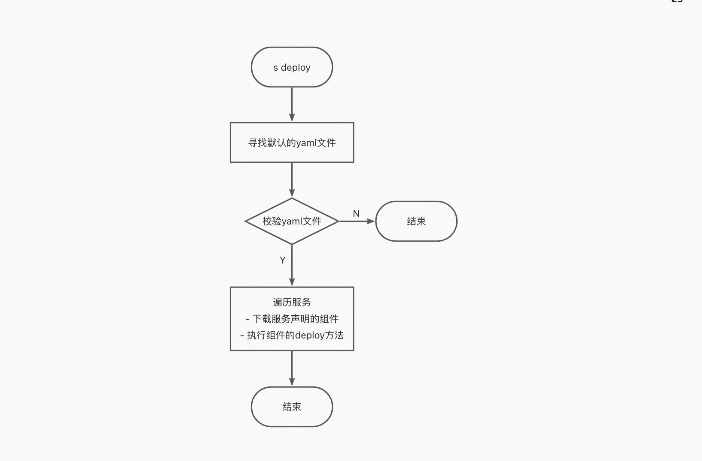
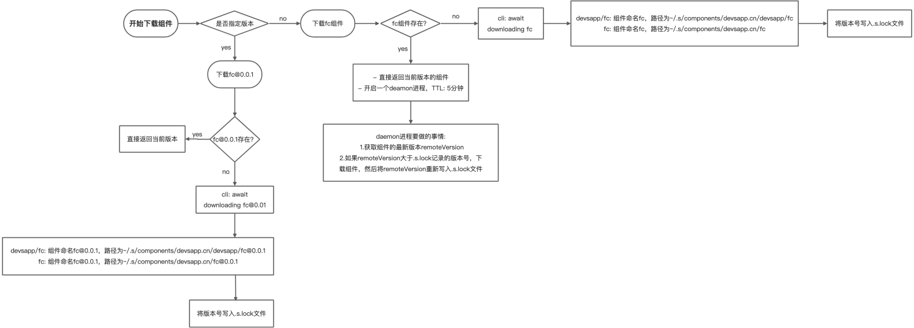

# serverless-devs 使用介绍

## 快速体验

### 安装

> 注意：node 版本 大于 12.x

```bash
npm install @serverless-devs/s -g
```

### 密钥配置

```bash
➜ s config add
? Please select a provider: Alibaba Cloud (alibaba)
🧭 Refer to the document for alibaba key:  http://config.devsapp.net/account/alibaba
? AccessKeyID:  LTA******************Ntx
? AccessKeySecret:  pcw************************Eww
? Please create alias for key pair. If not, please enter to skip test
? Alias already exists. Please select a type: overwrite

  Alias:           test
  AccessKeyID:     LTA******************Ntx
  AccessKeySecret: pcw************************Eww
  AccountID:       174**********624

✔ Configuration successful
```

### 上手体验

```bash
➜ s init

🚀  More applications: https://registry.serverless-devs.com

? Hello Serverless for Cloud Vendors Alibaba Cloud Serverless
? Hello, serverlesser. Which template do you like? Static website [Deploy a stat
ic website]
? Which template do you like? Vuepress

😋  Create application command: [s init devsapp/website-vuepress]

? Please input your project name (init dir) website-vuepress
? File website-vuepress already exists, override this file ? Yes
✔ file decompression completed

  Serverless Devs Application Case

    Cloud services required：
    - FC : https://fc.console.aliyun.com/

    Tips：
    - FC Component: https://www.serverless-devs.com/fc/readme
TypeError: Cannot read properties of null (reading '1')
    at Object.preInit (/Users/shihuali/workspace/a/website-vuepress1679818060018/hook/index.js:16:63)
    - Serverless Devs Version >= v2.0.103

创建应用所在的地区
? 地域 cn-hangzhou
只能包含字母、数字、下划线和中划线。不能以数字、中划线开头。长度在 1-128 之间。
? 服务名 website-wof2
应用的函数名称
? 函数名 vuepress
? please select credential alias default
✔ file decompression completed

    * Before using, please check whether the actions command in Yaml file is available
    * Carefully reading the notes in s.yaml is helpful for the use of the tool
    * If need help in the use process, please apply to join the Dingtalk Group: 33947367


🏄‍  Thanks for using Serverless-Devs
👉  You could [cd /Users/shihuali/workspace/a/website-vuepress] and enjoy your serverless journey!
🧭️  If you need help for this example, you can use [s -h] after you enter folder.
💞  Document ❤ Star: https://github.com/Serverless-Devs/Serverless-Devs
🚀  More applications: https://registry.serverless-devs.com

? Do you want to deploy the project immediately? Yes
[2023-03-26 16:08:08] [INFO] [S-CORE] - Start the pre-action
[2023-03-26 16:08:08] [INFO] [S-CORE] - Action: npm install
npm WARN old lockfile
npm WARN old lockfile The package-lock.json file was created with an old version of npm,
npm WARN old lockfile so supplemental metadata must be fetched from the registry.
npm WARN old lockfile
npm WARN old lockfile This is a one-time fix-up, please be patient...
npm WARN old lockfile

up to date, audited 1379 packages in 46s

89 packages are looking for funding
  run `npm fund` for details

49 vulnerabilities (2 low, 11 moderate, 27 high, 9 critical)

To address issues that do not require attention, run:
  npm audit fix

To address all issues (including breaking changes), run:
  npm audit fix --force

Run `npm audit` for details.
[2023-03-26 16:08:54] [INFO] [S-CORE] - Action: npm run build

> website-vuepress@1.0.0 build
> vuepress build docs

wait Extracting site metadata...
tip Apply theme @vuepress/theme-default ...
tip Apply plugin container (i.e. "vuepress-plugin-container") ...
tip Apply plugin @vuepress/register-components (i.e. "@vuepress/plugin-register-components") ...
tip Apply plugin @vuepress/active-header-links (i.e. "@vuepress/plugin-active-header-links") ...
tip Apply plugin @vuepress/search (i.e. "@vuepress/plugin-search") ...
tip Apply plugin @vuepress/nprogress (i.e. "@vuepress/plugin-nprogress") ...

✔ Client
  Compiled successfully in 9.33s

✔ Server
  Compiled successfully in 5.87s

Browserslist: caniuse-lite is outdated. Please run:
  npx browserslist@latest --update-db
  Why you should do it regularly: https://github.com/browserslist/browserslist#browsers-data-updating
wait Rendering static HTML...
success Generated static files in docs/.vuepress/dist.

[2023-03-26 16:09:10] [INFO] [S-CORE] - Action: website-fc
✔ website-fc.zip file decompression completed
✔ core@dev.zip file decompression completed
[2023-03-26 16:09:14] [INFO] [S-CORE] - End the pre-action
✔ Generated custom domain (3.22s)
⠙ Generated auto custom domain...
注意：当前域名并非阿里云官方域名，由 CNCF Project Serverless Devs 社区提供，仅供测试使用。
Note: The current domain name is not the official domain name of Alibaba Cloud. It is provided by the CNCF Project Serverless Devs community for testing purposes only
✔ Generated domain (4.92s)
✔ Checking Service, Function, Triggers (0.91s)
✔ Creating Service, Function, Triggers (1.55s)
✔ Creating custom domain (1.22s)

Tips for next step
======================
* Display information of the deployed resource: s info
* Display metrics: s metrics
* Display logs: s logs
* Invoke remote function: s invoke
* Remove Service: s remove service
* Remove Function: s remove function
* Remove Trigger: s remove trigger
* Remove CustomDomain: s remove domain


framework:
  region:   cn-hangzhou
  service:
    name: website-wof2
  function:
    name:       vuepress
    runtime:    custom
    handler:    index.handler
    memorySize: 512
    timeout:    30
  url:
    system_url:    https://vuepress-website-wof-rmpjkfybzs.cn-hangzhou.fcapp.run
    custom_domain:
      -
        domain: http://vuepress.website-wof2.1740298130743624.cn-hangzhou.fc.devsapp.net
  triggers:
    -
      type: http
      name: httpTrigger
```

## Yaml 文件

> 在默认情况下，Serverless Devs 开发者工具会默认该描述文件的名称为 s.yaml 或 s.yml，且 s.yaml 的优先级大于 s.yml， 即在一个 Serverless 应用下，同时出现 s.yaml 与 s.yml 时，系统会优先识别和使用 s.yaml。
> 当然，开发者也可以通过-t, --template [templatePath]进行指定，例如，在某应用在生产环境下的描述文件名为 s-prod.yml，则可以在执行相关命令时，增加参数-t s-prod.yml 或者--template s-prod.yml

### 变量赋值

- 获取全局变量：${vars.\*}
- 获取其他项目的变量：${projectName.props.\*}
- 获取 Yaml 中其他项目的结果变量：${projectName.output.\*}
- 获取当前机器中的环境变量：${env(环境变量)}，例如${env(secretId)}
- 获取外部文档的变量：${file(路径)}，例如${file(./path)}
- 获取当前配置的 config 变量：${config(AccountID)} 本质是获取 s config get 中变量值
- 获取当前模块的信息：${this.xx} 以下面的 Yaml 为例：

```yaml
edition: 1.0.0
name: NextProject
access: default-access

services:
  nextjs-portal:
    component: fc
    actions:
      pre-deploy:
        - run: s invoke ${this.props.url}
          path: ./backend_src
    props:
      codeUri: ./frontend_src
      url: url
```

在 nextjs-portal 中:

- 使用${this.name}表示 nextjs-portal
- 使用${this.props.codeUri}表示 ./frontend_src
- 使用${this.access}表示 default-access

#### Yaml eg

```yaml
# ------------------------------------
#   欢迎您使用阿里云函数计算 FC 组件进行项目开发
#   组件仓库地址：https://github.com/devsapp/fc
#   组件帮助文档：https://www.serverless-devs.com/fc/readme
#   Yaml参考文档：https://www.serverless-devs.com/fc/yaml/readme
#   关于：
#      - Serverless Devs和FC组件的关系、如何声明/部署多个函数、超过50M的代码包如何部署
#      - 关于.fcignore使用方法、工具中.s目录是做什么、函数进行build操作之后如何处理build的产物
#   等问题，可以参考文档：https://www.serverless-devs.com/fc/tips
#   关于如何做CICD等问题，可以参考：https://www.serverless-devs.com/serverless-devs/cicd
#   关于如何进行环境划分等问题，可以参考：https://www.serverless-devs.com/serverless-devs/extend
#   更多函数计算案例，可参考：https://github.com/devsapp/awesome/
#   有问题快来钉钉群问一下吧：33947367
# ------------------------------------
edition: 1.0.0 #  命令行YAML规范版本，遵循语义化版本（Semantic Versioning）规范
name: framework #  项目名称
# access 是当前应用所需要的密钥信息配置：
# 密钥配置可以参考：https://www.serverless-devs.com/serverless-devs/command/config
# 密钥使用顺序可以参考：https://www.serverless-devs.com/serverless-devs/tool#密钥使用顺序与规范
access: default

vars: # 全局变量
  region: cn-hangzhou
  service:
    name: website-wof2
    description: Serverless Devs Website Service
    internetAccess: true

services:
  framework: # 业务名称/模块名称
    component: fc # 组件名称
    actions:
      pre-deploy:
        # - run: npm install
        #   path: ./code
        # - run: npm run build
        #   path: ./code
        - plugin: website-fc
    props: # 组件的属性值
      region: ${vars.region}
      # service: ${vars.service}
      service: ${file(./file.yaml)}
      function:
        name: vuepress
        description: Serverless Devs Website vuepress Function
        codeUri: ./code/docs/.vuepress/dist
        timeout: 30
        memorySize: 512
        runtime: nodejs12
        environmentVariables:
          region: ${next-function.props.region}
          functionName: ${next-function.props.function.name}
          url: ${next-function.output.url.system_url}
          token: ${env.token}
          AccountID: ${config(AccountID)}
          name: ${this.name}
          access: ${this.access}
          codeUri: ${this.props.function.codeUri}
      triggers:
        - name: httpTrigger
          type: http
          config:
            authType: anonymous
            methods:
              - GET
              - POST
              - PUT
              - DELETE
      customDomains:
        - domainName: auto
          protocol: HTTP
          routeConfigs:
            - path: /*

  next-function: # 第二个函数的案例，仅供参考
    # 如果在当前项目下执行 s deploy，会同时部署模块：
    #   helloworld：服务hello-world-service，函数cpp-event-function
    #   next-function：服务hello-world-service，函数next-function-example
    # 如果想单独部署当前服务与函数，可以执行 s + 模块名/业务名 + deploy，例如：s next-function deploy
    # 如果想单独部署当前函数，可以执行 s + 模块名/业务名 + deploy function，例如：s next-function deploy function
    # 更多命令可参考：https://www.serverless-devs.com/fc/readme#文档相关
    component: fc
    actions:
      pre-deploy:
        - plugin: website-fc
    props:
      region: ${vars.region}
      service: ${vars.service} # 应用整体的服务配置
      function:
        name: next-function-example
        description: Serverless Devs Website vuepress Function
        codeUri: ./next-code
        timeout: 30
        memorySize: 512
        runtime: nodejs12
      triggers:
        - name: httpTrigger
          type: http
          config:
            authType: anonymous
            methods:
              - GET
              - POST
              - PUT
              - DELETE
      customDomains:
        - domainName: auto
          protocol: HTTP
          routeConfigs:
            - path: /*
```

### 服务顺序

如果一个 Yaml 文件中有多个服务，工具会默认分析部署顺序，该部署顺序分为两个步骤：

1. 分析项目中的依赖关系
2. 有依赖关系的按照依赖关系从前到后部署，无依赖关系的按 Yaml 配置的从上到下部署

### 行为描述

#### 全局 actions

> 注意：全局的 actions 中仅支持 run 和 plugin。

```yaml
actions: # 自定义全局的执行逻辑
  pre-命令: # 项目deploy执行之前执行
    - run: npm install # 要运行的命令行
      path: ./src # 命令行运行的路径
  success-命令: # 项目deploy执行成功之后执行
    - plugin: dingding-robot # 要使用的插件
      args: # 插件的参数
        key: value
  fail-命令: # 项目deploy执行失败之后执行
    - plugin: dingding-robot # 要使用的插件
      args: # 插件的参数
        key: value
  complete-命令: # 项目deploy执行完成之后执行
    - plugin: dingding-robot # 要使用的插件
      args: # 插件的参数
        key: value
```

#### 服务 actions

```yaml
actions: # 自定义执行逻辑
  pre-命令: # 在命令之前运行
    - run: command # 要运行的操作
      path: ./path # 运行操作的路径
    - component: pgo # 要执行的组件，格式为：组件名 命令 参数
    - plugin: website-fc # 要使用的插件
      args: # 插件的参数
        key: value
  post-命令: # 在命令之后运行
    - run: command # 要运行的操作
      path: ./path # 运行操作的路径
    - component: pgo # 要执行的组件，格式为：组件名 命令 参数
    - plugin: website-fc # 要使用的插件
      args: # 插件的参数
        key: value
```

#### 关于 actions 中的 run，component，plugin 的定位和区别：

- run，需要指定执行目录，仅仅是一个 hook 的能力，可以认为就是单纯的执行命令（即调用系统的命令）；
- component，使用格式是组件名 命令 参数，将会把当前项目所使用的密钥信息、属性信息等一并传给指定的组件方法；
- plugin，是一种轻量化的插件，每个插件通常情况下只会支持一个能力，与 component 最大的不同是，他可以修改属性。例如用户配置了 props 中的某个 k-v 为：codeUri: ./code：
  - 在使用 component 之后，当前信息（codeUri: ./code），会继续成为项目执行的参数，不会变更；
  - 在使用 plugin 之后，当前信息（codeUri: ./code），可能会发生变更，并将变更后的内容作为项目执行的参数；

#### eg

- 默认

```yaml
edition: 1.0.0 #  命令行YAML规范版本，遵循语义化版本（Semantic Versioning）规范
name: FullStack #  项目名称

services:
  nextjs-portal: #  服务名称
    component: test-component # 组件名称
    props: #  组件的属性值
      src: ./frontend_src
      url: url
```

用户在执行 s deploy -a mytest 后，系统会将密钥 mytest，以及 props 的参数（{"src": "./frontend_src", "url": "url"}）传递给组件 test-component 的 deploy 方法；

##### run

```yaml
edition: 1.0.0 #  命令行YAML规范版本，遵循语义化版本（Semantic Versioning）规范
name: FullStack #  项目名称

services:
  nextjs-portal: #  服务名称
    component: test-component # 组件名称
    actions: # 自定义执行逻辑
      pre-deploy: # 在deploy之前运行
        - run: s build
          path: ./
    props: #  组件的属性值
      src: ./frontend_src
      url: url
```

用户在执行 s deploy -a mytest 后，系统会：

- 在./目录下执行 s build，此时-a mytest 参数并不会直接传递给 s build 方法，可以认为纯粹的执行某个命令，无相关状态的继承和关联；
- 将密钥 mytest，以及 props 的参数（{"src": "./frontend_src", "url": "url"}）传递给组件 test-component 的 deploy 方法；

##### component

```yaml
edition: 1.0.0 #  命令行YAML规范版本，遵循语义化版本（Semantic Versioning）规范
name: FullStack #  项目名称

services:
  nextjs-portal: #  服务名称
    component: test-component # 组件名称
    actions: # 自定义执行逻辑
      pre-deploy: # 在deploy之前运行
        - component: fc build
    props: #  组件的属性值
      src: ./frontend_src
      url: url
```

用户在执行 s deploy -a mytest 后，系统会：

- 将密钥 mytest，以及 props 的参数（{"src": "./frontend_src", "url": "url"}）传递给组件 fc 的 build 方法；
- 将密钥 mytest，以及 props 的参数（{"src": "./frontend_src", "url": "url"}）传递给组件 test-component 的 deploy 方法

##### plugin

```yaml
edition: 1.0.0 #  命令行YAML规范版本，遵循语义化版本（Semantic Versioning）规范
name: FullStack #  项目名称

services:
  nextjs-portal: #  服务名称
    component: test-component # 组件名称
    actions: # 自定义执行逻辑
      pre-deploy: # 在deploy之前运行
        - plugin: qbuild
          args:
            key: value
    props: #  组件的属性值
      src: ./frontend_src
      url: url
```

用户在执行 s deploy -a mytest 后，系统会：

- 将密钥 mytest，以及 props 的参数（{"src": "./frontend_src", "url": "url"}），plugin 的参数（{"key": "value"}）传递给插件 qbuild，此时插件 qbuild 进行相关的业务处理，处理完成：
  - 如果返回信息对 props 进行了修改，那么会将密钥 mytest 以及修改后的 props 的传递给组件 test-component 的 deploy 方法；
  - 如果返回信息未对 props 进行了修改，那么会将密钥 mytest 以及原始的 props 的传递给组件 test-component 的 deploy 方法；

#### actions 通配符

```yaml
actions: # 自定义全局的执行逻辑
  pre-${regex(.)}: # 项目执行任何方法之前执行
    - run: npm install # 要运行的命令行
      path: ./src # 命令行运行的路径
  success-${regex(.)}: # 项目执行任何方法成功之后执行
    - plugin: dingding-robot # 要使用的插件
      args: # 插件的参数
        key: value
  fail-${regex(.)}: # 项目执行任何方法失败之后执行
    - plugin: dingding-robot # 要使用的插件
      args: # 插件的参数
        key: value
  complete-${regex(.)}: # 项目执行任何方法完成之后执行
    - plugin: dingding-robot # 要使用的插件
      args: # 插件的参数
        key: value
```

### Yaml 继承

通过关键字 extend， 解决多个 Yaml 配置冗余的问题。

比如使用 Serverless Devs 部署一个函数计算 FC 应用的时候，预发环境的和正式环境除了 service 名称不一致。其他配置完全一致。Yaml 配置如下

```yaml
├── code
├── s.yaml
├── s.prod.yaml
└── s.pre.yaml
```

#### **s.yaml**为默认配置

```yaml
edition: 1.0.0
access: 'default'
services:
  fc-deploy-test:
    component: fc
    props:
      region: cn-hangzhou
      service:
        name: fc-service
        nasConfig: Auto
        description: 'Serverless Devs Serivce'
      function:
        name: hello-function
        description: 'Serverless Devs Function'
        codeUri: './'
        runtime: nodejs12
        timeout: 60
```

#### **s.pre.yaml**配置如下

```yaml
extend: s.yaml
services:
  fc-deploy-test:
    props:
      service:
        name: fc-service-pre
        tracingConfig: Disable
```

#### **s.pro.yaml**配置如下

```yaml
extend: s.yaml
services:
  fc-deploy-test:
    props:
      service:
        name: fc-service-pro
        tracingConfig: Enable
```

#### 最终生效的配置

通过指定 yaml 配置 s deploy -t s.pro.yaml 生效

```yaml
edition: 1.0.0
access: 'default'
services:
  fc-deploy-test:
    component: fc
    props:
      region: cn-hangzhou
      service:
        name: fc-service-pro
        tracingConfig: Enable
        nasConfig: Auto
        description: 'Serverless Devs Serivce'
      function:
        name: hello-function
        description: 'Serverless Devs Function'
        codeUri: './'
        runtime: nodejs12
        timeout: 60
```

#### 合并规则

配置的合并使用[extend2](https://www.npmjs.com/package/extend2) 模块进行深度拷贝。 数组在做合并的时候，直接覆盖，而不是合并操作
const a = { arr: [1, 2], }; const b = { arr: [3], }; extend(true, a, b); // => { arr: [ 3 ] }

#### 最佳实践

Yaml 继承一般用作环境划分，比如预发环境为 s.pre.yaml，线上环境为 s.pro.yaml，部署时候通过指定对应部署模版 s deploy -t s.pro.yaml 配置。

## 应用级操作和服务级操作

### 应用级操作

s deploy: 部署全量的服务

### 服务级操作

s framework deploy: 指定部署某个服务

### s deploy 究竟做了什么？

- 主进程



- 组件的加载机制



- core 的自更新机制


- 组件如何引用 core 包

```bash
➜  fc ls -la
total 224
drwxr-xr-x  13 shihuali  staff    416  3  7 17:25 .
drwxr-xr-x  16 shihuali  staff    512  3 26 22:40 ..
-rw-r--r--   1 shihuali  staff     62  3 26 22:39 .s.lock
-rw-r--r--   1 shihuali  staff    337  3  6 12:03 CODE_OF_CONDUCT.md
-rw-r--r--   1 shihuali  staff  10508  3  6 12:03 CONTRIBUTING.md
drwxr-xr-x   3 shihuali  staff     96  2 21 17:01 dist
drwxr-xr-x   3 shihuali  staff     96  2 21 17:01 node_modules
-rw-r--r--   1 shihuali  staff   1947  3  6 12:03 package.json
-rw-r--r--@  1 shihuali  staff  64180  3  6 12:03 publish.yaml
-rw-r--r--   1 shihuali  staff   7385  3  6 12:03 readme.md
-rw-r--r--   1 shihuali  staff   7831  3  6 12:03 readme_en.md
-rw-r--r--   1 shihuali  staff    486  3  6 12:03 tsconfig.base.json
-rw-r--r--   1 shihuali  staff    234  3  6 12:03 tsconfig.json
➜  fc cd node_modules
➜  node_modules ls
@serverless-devs
➜  node_modules cd @serverless-devs
➜  @serverless-devs ls
core
➜  @serverless-devs ls -la
total 0
drwxr-xr-x  3 shihuali  staff  96  2 21 17:01 .
drwxr-xr-x  3 shihuali  staff  96  2 21 17:01 ..
lrwxr-xr-x  1 shihuali  staff  29  2 21 17:01 core -> /Users/shihuali/.s/cache/core
```

### 本地组件

component

```js
// component: ${path(./fc.js)}
class FC {
  deploy(inputs) {
    console.log('local deploy inputs', JSON.stringify(inputs, null, 2));
    return { message: 'this is a local fc' };
  }
}
module.exports = FC;
```

### [daemon 进程](https://nodejs.cn/api-v14/child_process/options_detached.html)

- child.js

```js
const sleep = (ms: number = 0) =>
  new Promise((resolve) => setTimeout(resolve, ms));

(async () => {
  console.log('child process started');
  await sleep(3000);
  console.log('child process ended');
})();
```

- start-daemon.js

```javascript
const { spawn } = require('child_process');

const subprocess = spawn(process.argv[0], ['child.js'], {
  detached: true,
  stdio: 'ignore',
});

subprocess.unref();
```

## 安全发布

- A 同学本地部署后，然后 B 同学在控制台更改了线上配置，然后 A 同学如果再次部署的话工具会提示相关变动以及选择本地配置还是线上配置。
- 如果还是 A 同学在本地更改配置，工具则不会进行提示。


## 日志查询


