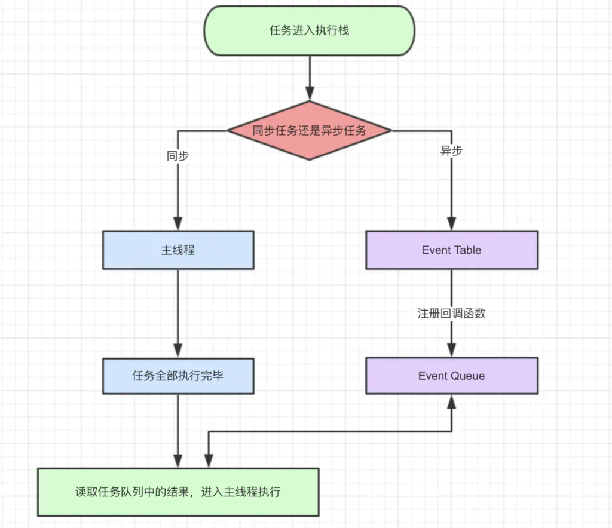
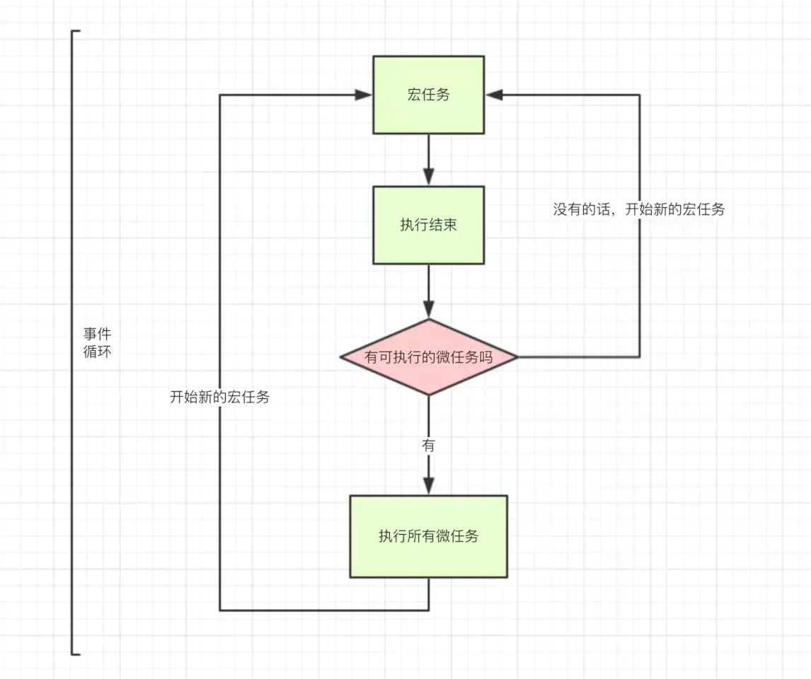

---
group:
  title: article
toc: content
---

# 事件循环

## JS 事件循环机制（event loop）之宏任务/微任务

- JavaScript 是单线程的语言
- Event Loop 是 javascript 的执行机制

## Event Loop

- 同步和异步任务分别进入不同的执行"场所"，同步的进入主线程，异步的进入 Event Table 并注册函数
- 当指定的事情完成时，Event Table 会将这个函数移入 Event Queue。
- 主线程内的任务执行完毕为空，会去 Event Queue 读取对应的函数，进入主线程执行。
- 上述过程会不断重复，也就是常说的 Event Loop(事件循环)。

- 我们不禁要问了，那怎么知道主线程执行栈为空呢？js 引擎存在 monitoring process 进程，会持续不断的检查主线程执行栈是否为空，一旦为空，就会去 Event Queue 那里检查是否有等待被调用的函数。

## 微任务(Microtasks)、宏任务(task)？

- 宏任务：包括整体代码 script，setTimeout，setInterval、setImmediate。
- 微任务：原生 Promise(有些实现的 promise 将 then 方法放到了宏任务中)、process.nextTick、Object.observe(已废弃)、 MutationObserver

- 一个宏任务执行完成过程中，就会去检测微任务队列是否有需要执行的任务，即使是微任务嵌套微任务，也会将微任务执行完成，再去执行下一个宏任务。
